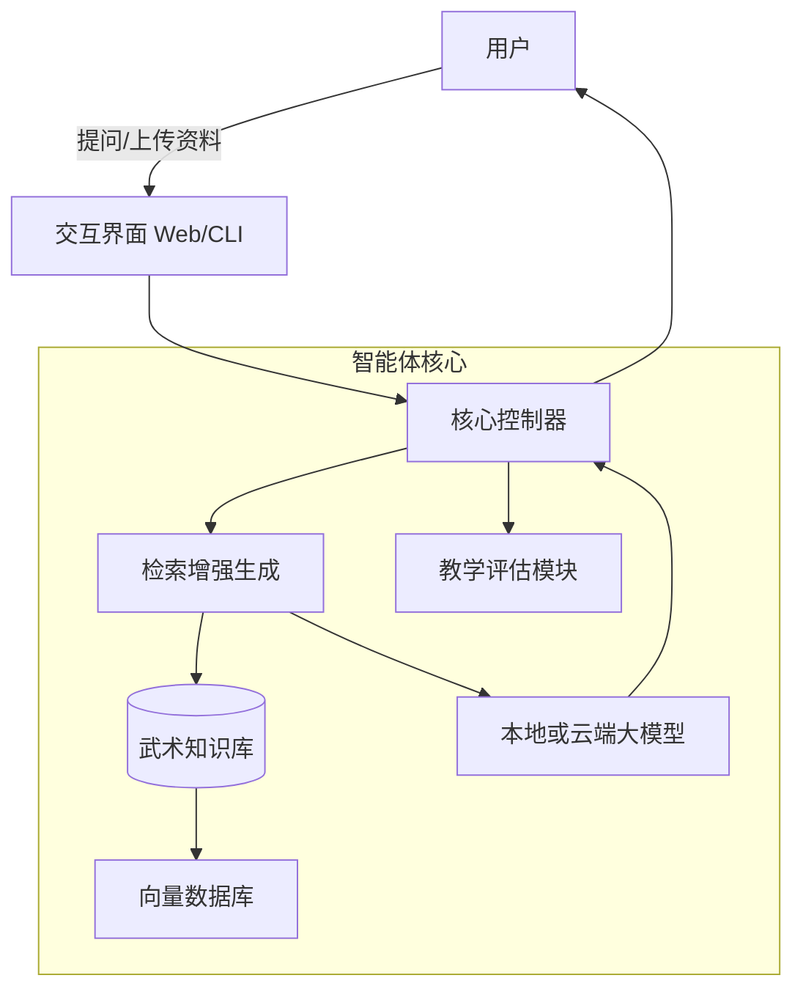

# 武术教学智能体 Martial Arts Teaching Agent

[中文说明](README.md) | [English](README_EN.md)

面向传统体育教学与研究场景的武术教学系统，融合武术领域知识检索与对话交互能力。

项目目标：

- 用 RAG 让回答更贴近武术教材与规范。
- 用本地模型降低成本并保护数据隐私。
- 用 Web 界面降低使用门槛，支持课堂演示与公开体验。

## 项目特点

- 领域知识增强：支持 txt 与 xlsx 资料入库检索。
- 本地推理部署：支持 Ollama，降低外部依赖。
- 双入口使用：CLI 和 Streamlit Web 均可用。
- 可扩展架构：已预留动作评估与研究评估模块扩展位。

## 系统架构



## 目录结构

- src: 核心代码
- data/knowledge_base: 武术知识资料
- docs: 文档与发布说明
- scripts: 辅助脚本
- tests: 测试目录

## 快速开始

### 1. 安装依赖

```bash
pip install -r requirements.txt
```

### 2. 启动本地模型服务

```bash
ollama pull qwen2.5:1.5b
ollama pull nomic-embed-text
```

### 3. 启动命令行模式

```bash
./scripts/run_cli.sh
```

首次建议输入 index 建立索引，随后再提问。

### 4. 启动 Web 演示界面

```bash
./scripts/run_web.sh
```

### 5. 环境健康检查

```bash
./scripts/health_check.sh
```

## 面向公开演示

- 局域网演示：streamlit run src/interface/app.py --server.address 0.0.0.0
- 公网临时分享：可使用 start_public.sh

## 开源协作

- 贡献指南：[CONTRIBUTING.md](CONTRIBUTING.md)
- 大文件建议：[docs/LARGE_FILES.md](docs/LARGE_FILES.md)
- GitHub 发布流程：[docs/GITHUB_RELEASE_GUIDE.md](docs/GITHUB_RELEASE_GUIDE.md)
- Issue 模板：[.github/ISSUE_TEMPLATE](.github/ISSUE_TEMPLATE)
- PR 模板：[.github/pull_request_template.md](.github/pull_request_template.md)

## 当前路线图

- 增加动作识别模块接入
- 增加评测数据记录与可视化
- 增加自动化测试与基线评测脚本

## 许可证

本项目采用 MIT License，见 [LICENSE](LICENSE)。
