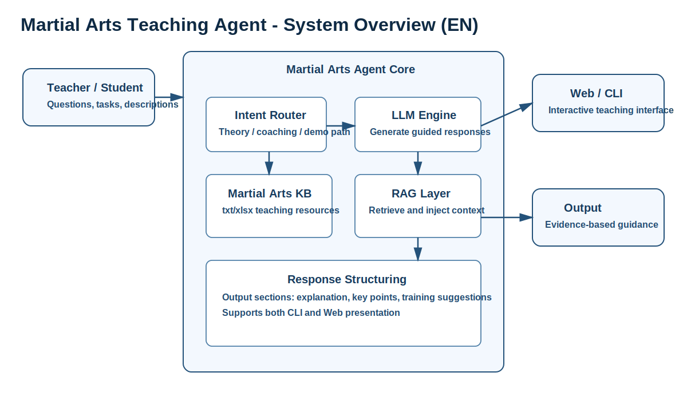
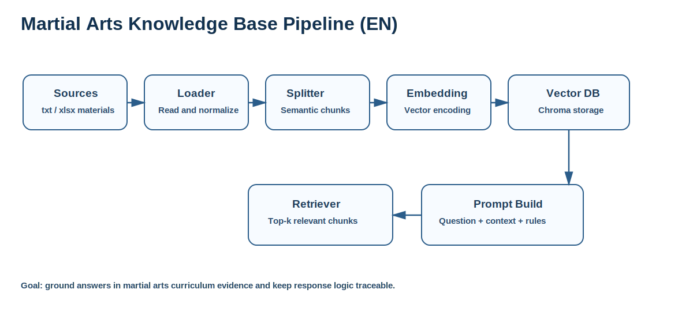
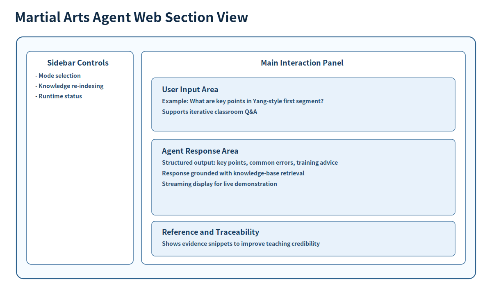

# Martial Arts Teaching Agent

[中文说明](README.md) | [English](README_EN.md)


A retrieval-enhanced teaching assistant for traditional martial arts education.

Affiliation: Professor Tang Lixu's research team, School of Wushu, Wuhan Sports University.

## Highlights

- Domain knowledge retrieval over txt/xlsx teaching materials
- Local model support with Ollama
- CLI and Web entry points for classroom and demo use
- Extensible structure for evaluation and motion-analysis modules

## System Overview Figure



## Knowledge Base Pipeline Figure



## Web Interface Section View



## Classroom Demo Flow Figure


## Getting Started

### Prerequisites

- Python 3.8+
- [Ollama](https://ollama.com)

### Install Dependencies

```bash
pip install -r requirements.txt
```

### Pull Local Models

```bash
ollama pull qwen2.5:1.5b
ollama pull nomic-embed-text
```

### Run CLI

```bash
./scripts/run_cli.sh
```

### Run Web UI

```bash
./scripts/run_web.sh
```

### Health Check

```bash
./scripts/health_check.sh
```

## Repository Structure

- src: core logic
- data/knowledge_base: source teaching materials
- docs: project documentation
- scripts: utility scripts
- tests: test placeholders

Repository name convention: use `martial-arts-agent` in technical references and documentation.

## Demo Notes

- Classroom demo: run `./scripts/health_check.sh` first.
- Web demo: run `./scripts/run_web.sh`.
- Data demo: update `data/knowledge_base`, then rebuild the index before asking questions.

## Open Source Workflow

- Contributing guide: [CONTRIBUTING.md](CONTRIBUTING.md)
- Large file strategy: [docs/LARGE_FILES.md](docs/LARGE_FILES.md)
- Issue templates: [.github/ISSUE_TEMPLATE](.github/ISSUE_TEMPLATE)
- PR template: [.github/pull_request_template.md](.github/pull_request_template.md)

## FAQ

### 1. Why is response speed slow?

Use `qwen2.5:1.5b` and verify local model status with `./scripts/health_check.sh`.

### 2. Why does updated knowledge not appear in answers?

Rebuild the index after updating `data/knowledge_base`.

### 3. Why do I see large file warnings on GitHub?

The repository includes large `.xlsx` files. See [docs/LARGE_FILES.md](docs/LARGE_FILES.md) for Git LFS guidance.

## License

MIT License. See [LICENSE](LICENSE).
