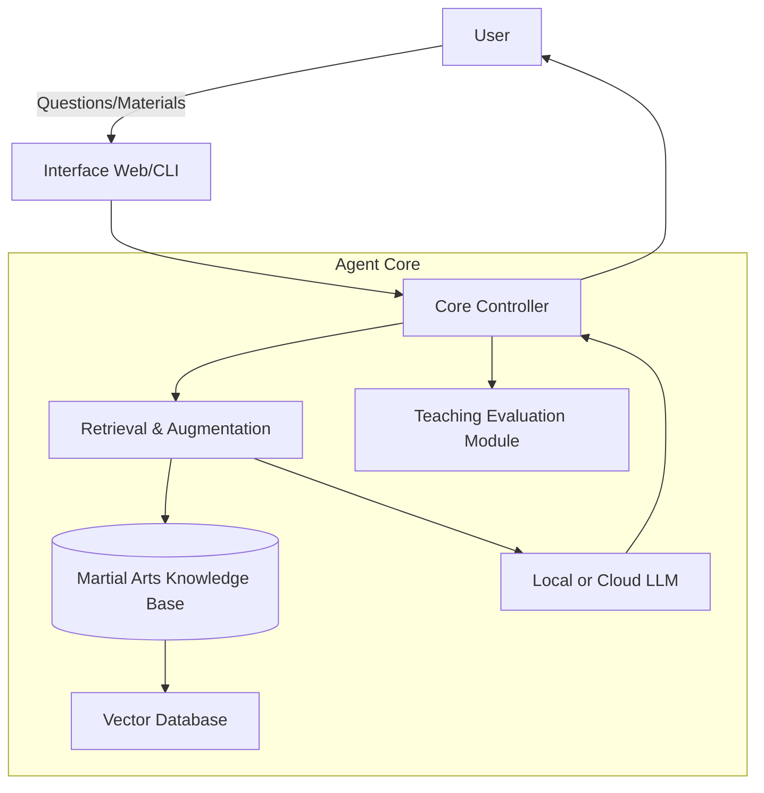
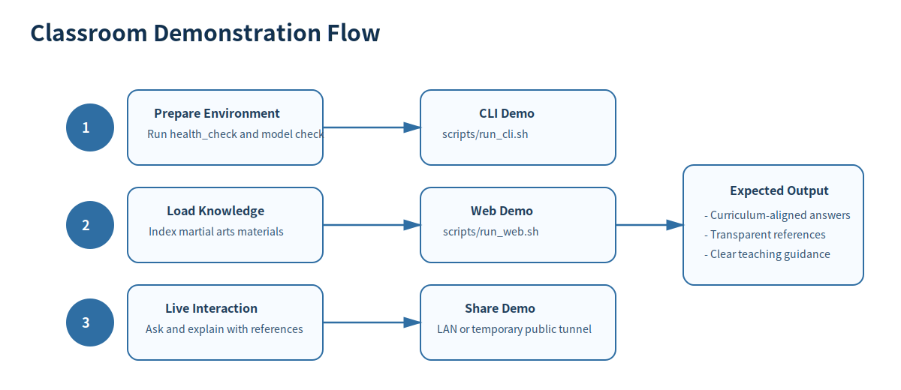

# Martial Arts Teaching Agent

[中文说明](README.md) | [English](README_EN.md)


A system for traditional martial arts teaching and research, integrating domain knowledge retrieval and interactive dialogue capabilities.

Affiliation: Professor Tang Lixu's research team, School of Wushu, Wuhan Sports University.

## Project Objectives

- Use RAG (Retrieval-Augmented Generation) to provide answers more aligned with martial arts textbooks and standards.
- Deploy local models to reduce costs and protect data privacy.
- Provide web interface to lower usage threshold and support classroom demonstrations and public demos.

## Latest Updates (2026-04)

- Digital human interaction upgraded with server-side real TTS (edge-tts), reducing browser permission instability.
- Text-driven action demo: parse action sequences from long text and present steps, common mistakes, and correction tips.
- Synchronized playback: action demo can run in sync with generated narration audio.
- Multimodal teaching tools improved: uploaded video analysis, real-time camera detection, and scoring feedback.
- Deployment improvements: added Docker and docker-compose support, ready for Railway auto-deploy from GitHub.

## Features

- Domain knowledge enhancement: Support txt and xlsx materials for knowledge base retrieval.
- Local inference deployment: Support Ollama to minimize external dependencies.
- Dual interface: Both CLI and Streamlit Web are available.
- Digital teaching assistant: script polishing, real audio generation, and audio download.
- Text-to-action teaching: multi-action sequence extraction with instructional correction hints.
- Extensible architecture: Pre-reserved extensions for motion evaluation and research assessment modules.

## System Architecture



## System Overview Figure


## Knowledge Base Pipeline Figure


## Web Interface Section View


## Classroom Demo Flow Figure



## Getting Started

### Prerequisites

- Python 3.8+
- [Ollama](https://ollama.com)

### Install Dependencies

```bash
pip install -r requirements.txt
```

### Pull Local Models

```bash
ollama pull qwen2.5:1.5b
ollama pull nomic-embed-text
```

### Run CLI

```bash
./scripts/run_cli.sh
```

### Run Web UI

```bash
./scripts/run_web.sh
```

### Health Check

```bash
./scripts/health_check.sh
```

### Run with Docker (Optional)

```bash
docker-compose up --build
```

## Repository Structure

- src: core logic
- data/knowledge_base: source teaching materials
- docs: project documentation
- scripts: utility scripts
- tests: test placeholders

## Demo Notes

- Classroom demo: run `./scripts/health_check.sh` first.
- Web demo: run `./scripts/run_web.sh`.
- Data demo: update `data/knowledge_base`, then rebuild the index before asking questions.

## Public Sharing and Deployment

- LAN demo: `streamlit run src/interface/app.py --server.address 0.0.0.0`
- Temporary public tunnel: `./start_public.sh`
- Stable production link: deploy on Railway with GitHub auto-deploy

See full deployment guide: [DEPLOYMENT.md](DEPLOYMENT.md)

## Current Roadmap

- Improve pose keypoint precision and fine-grained action scoring
- Add classroom report export (PDF/image)
- Add end-to-end tests and post-deploy health checks

## Open Source Workflow

- Contributing guide: [CONTRIBUTING.md](CONTRIBUTING.md)
- Large file strategy: [docs/LARGE_FILES.md](docs/LARGE_FILES.md)
- Issue templates: [.github/ISSUE_TEMPLATE](.github/ISSUE_TEMPLATE)
- PR template: [.github/pull_request_template.md](.github/pull_request_template.md)

## FAQ

### 1. Why is response speed slow?

Use `qwen2.5:1.5b` and verify local model status with `./scripts/health_check.sh`.

### 2. Why does updated knowledge not appear in answers?

Rebuild the index after updating `data/knowledge_base`.

### 3. Why do I see large file warnings on GitHub?

The repository includes large `.xlsx` files. See [docs/LARGE_FILES.md](docs/LARGE_FILES.md) for Git LFS guidance.

## License

MIT License. See [LICENSE](LICENSE).
